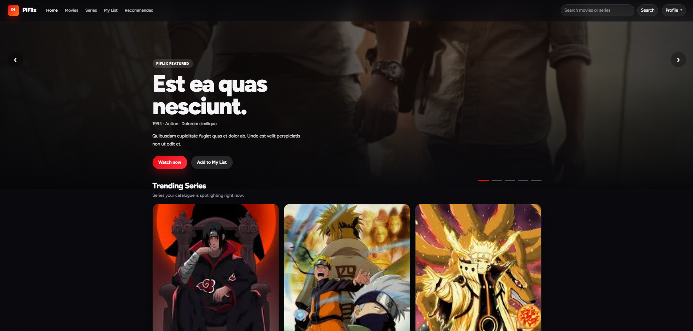
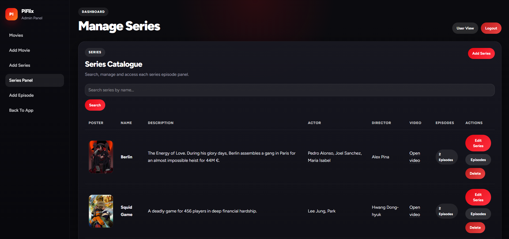

# 🎬 PiFlix

<p align="center">
  Aplicación web estilo plataforma de streaming construida con <strong>Laravel 9 + Blade</strong>.<br>
  Refactorizada como proyecto de portfolio para demostrar arquitectura MVC real, refactorización progresiva,<br>
  gestión de usuarios, panel admin y una experiencia visual moderna inspirada en plataformas de streaming.
</p>

<p align="center">
  
  
  
  
  
</p>

<p align="center">
  
</p>

---

## 🔗 Repositorio

https://github.com/josuepinto/streaming-laravel-vue

---

## 🧾 Descripción del proyecto

PiFlix simula una pequeña plataforma de streaming donde un usuario puede:

- registrarse e iniciar sesión
- navegar por el catálogo de películas
- navegar por el catálogo de series
- ver el detalle de una película
- ver el detalle de una serie con sus episodios
- añadir y quitar favoritos
- consultar recomendaciones
- visualizar una página de suscripción

Además, un administrador puede:

- crear, editar y eliminar películas
- crear, editar y eliminar series
- crear, editar y eliminar episodios
- gestionar el catálogo desde un panel de administración

Esta rama representa la **versión Laravel + Blade** del proyecto y es la implementación principal orientada a portfolio.

---

## 🎯 Objetivo

Convertir un proyecto académico en una aplicación más sólida, mantenible y presentable a nivel profesional, demostrando:

- estructura MVC real en Laravel
- autenticación con contraseñas hasheadas
- separación entre usuario y administrador
- gestión de películas, series y episodios
- sistema de favoritos para películas y series
- una interfaz moderna, oscura y visualmente inspirada en plataformas de streaming

---

## 🚀 Funcionalidades principales

### Zona pública / usuario
- registro de usuarios
- login con sesión personalizada
- home con diseño tipo streaming
- catálogo de películas
- catálogo de series
- página de detalle de película
- página de detalle de serie con filtro por temporada
- sistema de favoritos por usuario
- página de recomendaciones
- página de suscripción

### Zona de administración
- protección por middleware `admin`
- gestión de películas
- gestión de series
- gestión de episodios
- formularios de creación y edición

### Mejoras aplicadas en la refactorización
- contraseñas hasheadas correctamente
- separación clara entre usuario y admin
- favoritos polimórficos
- UI rediseñada con una identidad visual más profesional
- README alineado con el estado real del proyecto

<p align="center">
  
</p>

---

## 🧠 Relevancia profesional

PiFlix no se plantea como un CRUD académico simple.  
Se está refactorizando intencionalmente como una pieza de portfolio para demostrar:

- criterio arquitectónico en Laravel
- capacidad de refactorizar código existente
- atención a la experiencia de usuario
- consistencia visual
- mejora progresiva de calidad técnica

Este proyecto refleja mi capacidad para trabajar sobre una aplicación ya existente, entender su arquitectura, detectar inconsistencias y mejorarla progresivamente sin romper funcionalidad.

Ese tipo de trabajo es especialmente relevante en entornos reales de empresa, donde muchas veces no se construye todo desde cero, sino que se mantiene, corrige, limpia y evoluciona software ya en producción o heredado.

---

## 🏗️ Arquitectura actual

### Estructura principal

```txt
app/
  Http/
    Controllers/
      UserController.php
      MovieListController.php
      SeriesListController.php
      EpisodeController.php
      FavouriteController.php
    Middleware/
      AdminMiddleware.php
    Requests/
      MovieRequest.php

app/Models/
  Movie.php
  Serie.php
  Episode.php
  Favourite.php
  User.php

resources/views/
  home.blade.php
  moviesList.blade.php
  seriesList.blade.php
  showSerie.blade.php
  user/
  admin/
  layouts/

database/
  migrations/
  seeders/
```

### Modelo funcional

#### Películas
Cada película contiene:

- título
- descripción
- actor
- director
- género
- año
- imagen
- URL de vídeo

#### Series
Cada serie contiene:

- nombre
- descripción
- actor
- director
- imagen
- URL de vídeo

#### Episodios
Cada episodio pertenece a una serie y contiene:

- título
- temporada
- número de episodio
- URL de vídeo
- imagen opcional

#### Favoritos
Los favoritos:

- pertenecen a un usuario
- son polimórficos
- pueden referenciar una película o una serie

---

## 🔐 Autenticación y roles

PiFlix usa actualmente un sistema de autenticación **personalizado basado en sesión**.

### Flujo de usuario
- registro desde `/`
- login desde `/login`
- la sesión guarda:
  - `user_id`
  - `user_name`

### Flujo de administrador
El acceso al panel admin está protegido con middleware y con el campo `is_admin` en la tabla `users`.

Por defecto, los usuarios registrados **no son administradores**.

Si quieres probar el panel admin, promociona manualmente un usuario en base de datos:

```sql
UPDATE users
SET is_admin = 1
WHERE email = 'tu-email@example.com';
```

Después de eso, ese usuario podrá entrar a las rutas de administración.

---

## 🗺️ Rutas principales

### Autenticación
- `/` → registro
- `/login` → login
- `/logout` → logout

### Zona usuario
- `/home`
- `/films`
- `/watch/{movie}`
- `/series`
- `/seriesList/{id}`
- `/favourite`
- `/subs`
- `/recomends`

### Zona admin
- `/admin/panel`
- `/admin/addMovie`
- `/admin/addSerie`
- `/admin/addEpisode`
- `/admin/seriesPanel`
- rutas de edición, actualización y borrado de películas, series y episodios

---

## 🧪 Qué he aprendido

Durante esta refactorización he trabajado especialmente en:

- refactorización de código existente sin romper funcionalidades ya implementadas
- diseño de relaciones de base de datos más limpias, como favoritos polimórficos
- separación de responsabilidades en Laravel usando una estructura MVC más real
- mejora progresiva de una aplicación existente, tanto a nivel visual como arquitectónico
- debugging de problemas reales de backend, vistas, validaciones, rutas e imágenes

Este proyecto refleja mi forma de trabajar:

- iterativa
- orientada a mantenimiento y mejora continua
- enfocada en soluciones claras, defendibles y mantenibles

---

## ⚠️ Retos técnicos

Algunos de los retos más importantes durante el desarrollo han sido:

- migrar el sistema de contraseñas desde texto plano a `Hash` sin romper el flujo de login
- reestructurar favoritos para soportar múltiples tipos de contenido, películas y series
- mantener coherencia visual en cards con contenido dinámico y longitudes de texto diferentes
- mejorar la separación entre zona pública y zona admin sin romper la navegación existente
- gestionar inconsistencias entre rutas de imagen en `public` y en `storage`
- revisar y limpiar duplicidades en controladores y lógica heredada del proyecto original

Estos problemas se han resuelto con un enfoque incremental, revisando el estado real del proyecto antes de aplicar cada mejora.

---

## 🎨 Frontend e interacción

Aunque esta rama está centrada en **Laravel + Blade**, el proyecto también incorpora comportamiento de frontend útil para una experiencia más realista:

- hero principal con interacción dinámica
- navegación visual tipo plataforma de streaming
- manipulación del DOM para mejorar la experiencia de usuario
- integración con **Vite** para desarrollo moderno de assets
- trabajo de consistencia visual entre vistas públicas, auth y panel admin

---

## 🧩 Tecnologías utilizadas

- Laravel 9
- PHP 8
- Blade
- Bootstrap 5
- Vite
- JavaScript
- MySQL / MariaDB
- Docker / Laravel Sail
- CSS personalizado
- Git

---

## ⚙️ Instalación

### 1. Clonar el repositorio

```bash
git clone https://github.com/josuepinto/streaming-laravel-vue.git
cd streaming-laravel-vue
```

### 2. Copiar el archivo de entorno

```bash
cp .env.example .env
```

### 3. Levantar contenedores

```bash
./vendor/bin/sail up -d
```

### 4. Instalar dependencias PHP

```bash
./vendor/bin/sail composer install
```

### 5. Generar la clave de la aplicación

```bash
./vendor/bin/sail artisan key:generate
```

### 6. Instalar dependencias frontend

```bash
./vendor/bin/sail npm install
```

### 7. Crear el enlace simbólico de storage

```bash
./vendor/bin/sail artisan storage:link
```

### 8. Ejecutar migraciones y seeders

Como el proyecto está en fase de refactor y conviene partir de una base limpia para probarlo, el comando recomendado es:

```bash
./vendor/bin/sail artisan migrate:fresh --seed
```

### 9. Lanzar Vite

```bash
./vendor/bin/sail npm run dev
```

### 10. Abrir la aplicación

Normalmente estará disponible en:

```txt
http://localhost
```

---

## 🌱 Datos de prueba

Los seeders actuales crean:

- películas demo
- series demo
- episodios demo asociados a esas series

No crean:

- un usuario administrador por defecto

Por tanto, para probar todo el flujo:

1. registra un usuario manualmente
2. conviértelo en admin desde base de datos si quieres probar el panel

---

## 🖼️ Notas sobre imágenes

Actualmente el proyecto mezcla dos estrategias de rutas de imagen:

- rutas públicas como `image/...`
- rutas basadas en storage como `series_images/...` o `episodes/...`

Eso funciona en el estado actual, pero también es una zona identificada para futura limpieza y unificación.

Si una imagen subida no se muestra:

1. asegúrate de haber ejecutado:

```bash
./vendor/bin/sail artisan storage:link
```

2. revisa el valor guardado en la base de datos
3. comprueba si la vista espera `asset(...)` o `asset('storage/...')`

---

## 📌 Estado actual

PiFlix está en una fase sólida de **refactorización orientada a portfolio**.

### Ya mejorado
- autenticación con hash
- middleware admin
- favoritos por usuario
- favoritos para películas y series
- rediseño visual de la app pública
- rediseño visual de auth y admin
- limpieza progresiva de controladores
- documentación más honesta y profesional

### Pendiente de mejora futura
- unificar estrategia de imágenes
- reforzar validaciones con más `FormRequest`
- añadir tests
- mejorar la lógica de recomendaciones
- eliminar metadatos duplicados como contadores manuales si no son necesarios
- seguir puliendo consistencia técnica y visual

---

## 🔄 Mejoras futuras

Las siguientes mejoras serían las más valiosas para seguir elevando el proyecto:

- implementar una capa de servicios para separar mejor la lógica de negocio
- añadir tests básicos para auth, favoritos, admin y flujos críticos
- migrar progresivamente la autenticación hacia un sistema estándar de Laravel si el proyecto creciera
- unificar por completo la estrategia de imágenes
- mejorar el sistema de recomendaciones con lógica más real
- reducir metadatos duplicados y derivar más información desde relaciones reales

---

## 🧠 Conclusión

PiFlix representa una aplicación de streaming pequeña pero realista, refactorizada con enfoque profesional para demostrar capacidad de trabajar en backend con Laravel, estructurar una aplicación mantenible y mejorar progresivamente un sistema ya existente sin romper funcionalidad.

---

## 👨‍💻 Autor

**Josue Pinto**

Refactorización orientada a portfolio de un proyecto académico de streaming, centrada en Laravel, Blade, arquitectura MVC, coherencia visual y calidad del código.

---

## 📄 Licencia

Proyecto compartido con fines educativos, de aprendizaje y portfolio.
